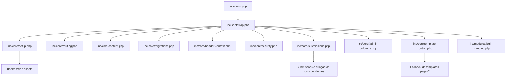

# A11YHUBBR Theme

Tema WordPress customizado do projeto **A11YBR**.

## 1. Arquitetura (visão geral)

O tema segue arquitetura modular em PHP + Sass.

Fluxo de boot:
1. `functions.php` carrega apenas `inc/bootstrap.php`.
2. `inc/bootstrap.php` inclui os módulos ativos em `inc/core/*` e `inc/modules/*`.
3. Cada módulo registra seus hooks (`add_action` / `add_filter`) e expõe funções utilitárias.
4. Templates em `pages/` e `single*.php` consomem essas funções e componentes de `inc/components/`.



## 2. Estrutura de arquivos

### 2.1 Arquivos raiz do tema

- `functions.php`: ponto de entrada mínimo do tema.
- `header.php`: cabeçalho global, navegação principal, busca e CTA de submeter.
- `footer.php`: rodapé global, menus de rodapé e newsletter.
- `front-page.php`: home com hero, categorias e blocos de destaque.
- `page.php`: fallback padrão para páginas.
- `single.php`: single padrão de conteúdo (`post`).
- `single-a11y_evento.php`: single do CPT de eventos.
- `single-a11y_perfil.php`: single do CPT de perfil/rede.
- `index.php`: fallback final do WordPress.
- `style.css`: CSS compilado final (saída do Sass).
- `theme.json`: tokens e configurações do editor de blocos.
- `screenshot.png`: preview e fallback de logo na tela de login.

### 2.2 Pasta `inc/`

- `inc/bootstrap.php`: loader central dos módulos.

#### `inc/core/` (núcleo ativo)

- `setup.php`: enqueue de assets, resource hints, setup do tema e suporte de excerpt em páginas.
- `routing.php`: resolução de URLs por template e regras de menu primário.
- `content.php`: mapa de tipos de conteúdo, redes sociais, busca por termo e parser de tags.
- `migrations.php`: migrações de dados/metadados e provisionamento de páginas.
- `header-context.php`: contexto visual (conteúdos/eventos/rede), body classes e componente de header de página.
- `security.php`: painel de segurança, Turnstile e validação antispam.
- `submissions.php`: CPTs de submissão, sanitização/validação, criação de posts pendentes e envio de e-mail.
- `admin-columns.php`: colunas customizadas no admin para `post`, `a11y_evento` e `a11y_perfil`.
- `template-routing.php`: fallback de template por slug e fallback virtual para `/busca`.
- `functions-legacy.php`: cópia legada com implementação antiga (não deve ser carregada no bootstrap atual).

#### `inc/components/` (blocos reutilizáveis)

- `archive-toolbar.php`: toolbar de busca/ordenação/paginação dos arquivos.
- `content-card.php`: card de conteúdo.
- `event-card.php`: card de evento.
- `profile-card.php`: card de perfil/rede.
- `listing-card.php`: card genérico de listagem.
- `feature-card.php`: card de feature/benefício.
- `empty-state.php`: estados vazios com CTA contextual.
- `cta-box.php`: bloco de call-to-action reutilizável.
- `single-side-engagement.php`: ações laterais no single (compartilhar/sugerir).

#### `inc/sections/` (seções reutilizáveis)

- `como-funciona.php`: seção “como funciona”.
- `faca-parte.php`: seção “faça parte”.

#### `inc/modules/`

- `login-branding.php`: branding da tela de login.

### 2.3 Pasta `pages/` (templates de página)

- `page-acessibilidade.php`: declaração de acessibilidade.
- `page-busca.php`: busca unificada (conteúdos, eventos e rede).
- `page-contato.php`: formulário de contato/sugestão.
- `page-conteudos.php`: listagem e filtros de conteúdos.
- `page-diretrizes.php`: diretrizes da comunidade/plataforma.
- `page-eventos.php`: listagem e filtros de eventos.
- `page-politica-de-privacidade.php`: política de privacidade.
- `page-rede.php`: listagem e filtros de perfis/rede.
- `page-sobre.php`: página institucional.
- `page-submeter.php`: hub de submissões.
- `page-submeter-conteudo.php`: formulário de submissão de conteúdo.
- `page-submeter-eventos.php`: formulário de submissão de eventos.
- `page-submeter-perfil.php`: formulário de submissão de perfil/rede.

### 2.4 Front-end (assets)

- `assets/scss/main.scss`: entrypoint Sass.
- `assets/scss/partials/*`: SCSS modular por domínio (`base`, `layout`, `pages`, `utilities`).
- `assets/js/forms.js`: interações dos formulários (condicionais, comportamento dinâmico, UX de campos).
- `assets/css/theme.css`: CSS auxiliar legado/em transição.
- `assets/img/*`: imagens e padrões visuais.

### 2.5 Ferramentas e documentação

- `docs/auditoria-tecnica.md`: histórico de auditoria técnica e limpeza.
- `tools/scan-mojibake-db.php`: varredura de problemas de encoding no banco.
- `tools/fix-mojibake.php`: utilitário de correção de mojibake (usar com backup).

## 3. Referência de funções (por arquivo)

### 3.1 `inc/core/setup.php`

- `a11yhubbr_enqueue_assets`: enfileira `style.css`, Font Awesome e `forms.js` quando necessário.
- `a11yhubbr_resource_hints`: adiciona preconnect para CDNs.
- `a11yhubbr_theme_setup`: ativa supports do tema e registra menus.
- `a11yhubbr_enable_page_excerpt_support`: habilita excerpt no post type `page`.

### 3.2 `inc/core/routing.php`

- `a11yhubbr_get_page_url_by_template`: resolve URL de página via meta `_wp_page_template`.
- `a11yhubbr_get_submit_content_url`: URL da página de submeter conteúdo.
- `a11yhubbr_get_submit_event_url`: URL da página de submeter evento.
- `a11yhubbr_get_submit_profile_url`: URL da página de submeter perfil.
- `a11yhubbr_get_accessibility_page_url`: URL da página de acessibilidade.
- `a11yhubbr_get_terms_page_url`: URL da página de termos.
- `a11yhubbr_get_privacy_page_url`: URL da página de privacidade.
- `a11yhubbr_get_search_page_url`: URL da página de busca.
- `a11yhubbr_is_submit_path_active`: identifica contexto `/submeter` para highlight de menu.
- `a11yhubbr_nav_menu_classes`: injeta classes de item atual no menu primário.
- `a11yhubbr_filter_primary_menu_items`: remove item redundante de “submeter” no menu primário.

### 3.3 `inc/core/content.php`

- `a11yhubbr_get_content_type_map`: mapa de categorias/tipos e ícones.
- `a11yhubbr_get_content_type_by_slug`: retorna dados do tipo por slug.
- `a11yhubbr_get_content_type_slug_from_input`: normaliza entrada para slug válido (com aliases legados).
- `a11yhubbr_get_social_icon_class`: escolhe ícone da rede por chave ou host da URL.
- `a11yhubbr_get_social_network_key`: detecta chave de rede por chave explícita ou domínio da URL.
- `a11yhubbr_find_posts_by_term`: busca IDs por texto e metadados.
- `a11yhubbr_parse_tags_from_input`: sanitiza e deduplica tags separadas por vírgula.

### 3.4 `inc/core/migrations.php`

- `a11yhubbr_migrate_legacy_content_type_meta_to_category`: migra meta legado de tipo para taxonomy `category`.
- `a11yhubbr_migrate_legacy_network_posts_to_profiles`: migra posts antigos de rede para CPT `a11y_perfil`.
- `a11yhubbr_rename_books_category_once`: renomeia categoria para “Livros e Materiais”.
- `a11yhubbr_sync_pages_title_excerpt_once`: sincroniza títulos/resumos de páginas por template.
- `a11yhubbr_ensure_diretrizes_page_once`: cria/garante página “Diretrizes”.
- `a11yhubbr_ensure_contato_page_once`: cria/garante página “Contato”.
- `a11yhubbr_rename_community_to_rede_once`: migra naming “Comunidade” para “Rede”.
- `a11yhubbr_seed_legal_pages_once`: provisiona páginas legais e busca.
- `a11yhubbr_migrate_page_templates_to_pages_dir_once`: atualiza templates para prefixo `pages/`.

### 3.5 `inc/core/header-context.php`

- `a11yhubbr_get_header_context`: identifica contexto visual da rota (`conteudos`, `eventos`, `rede`, `default`).
- `a11yhubbr_add_context_body_class`: adiciona classe de contexto ao `<body>`.
- `a11yhubbr_render_page_header`: renderiza header interno com breadcrumb, ícone, título e resumo.

### 3.6 `inc/core/security.php`

- `a11yhubbr_security_settings_register`: registra opções de segurança (Turnstile).
- `a11yhubbr_security_menu`: adiciona página de configurações de segurança no admin.
- `a11yhubbr_get_turnstile_site_key`: obtém site key (constante ou option).
- `a11yhubbr_get_turnstile_secret_key`: obtém secret key (constante ou option).
- `a11yhubbr_is_turnstile_enabled`: valida se anti-bot está realmente ativo/configurado.
- `a11yhubbr_render_security_page`: UI de configuração no admin.
- `a11yhubbr_render_human_check_field`: renderiza widget Turnstile no formulário.
- `a11yhubbr_turnstile_is_valid`: valida token enviado contra API do Cloudflare.

### 3.7 `inc/core/submissions.php`

- `a11yhubbr_register_submission_cpts`: registra CPTs `a11y_evento` e `a11y_perfil`.
- `a11yhubbr_flush_rewrite_rules_once`: flush único de rewrite rules.
- `a11yhubbr_get_submission_config`: define configuração por tipo de formulário (botão/nonce/rótulo).
- `a11yhubbr_get_content_context_config`: define regras contextuais e opções de campos.
- `a11yhubbr_sanitize_choice`: sanitiza valor fechado contra lista permitida.
- `a11yhubbr_detect_form_type`: detecta tipo de submissão via botão enviado.
- `a11yhubbr_sanitize_submission_data`: sanitiza payload dos formulários.
- `a11yhubbr_validate_content_submission_data`: valida payload de conteúdo.
- `a11yhubbr_validate_event_submission_data`: valida payload de evento.
- `a11yhubbr_create_pending_content_post`: cria `post` pendente com metadados de conteúdo.
- `a11yhubbr_create_pending_event_post`: cria `a11y_evento` pendente com metadados.
- `a11yhubbr_create_pending_profile_post`: cria `a11y_perfil` pendente com metadados e thumbnail.
- `a11yhubbr_build_email_message`: monta corpo de e-mail para moderação.
- `a11yhubbr_send_submission_email`: dispara e-mail para admin.
- `a11yhubbr_get_submission_fingerprint`: fingerprint por IP + user agent + tipo.
- `a11yhubbr_is_submission_rate_limited`: aplica limite de tentativas por janela.
- `a11yhubbr_track_submission_attempt`: incrementa contador de tentativas.
- `a11yhubbr_is_submission_spam_request`: valida honeypot, timestamp e Turnstile.
- `a11yhubbr_get_redirect_target`: resolve URL segura de retorno pós-submissão.
- `a11yhubbr_handle_form_submissions`: orquestra fluxo completo de submissão.

### 3.8 `inc/core/admin-columns.php`

- `a11yhubbr_columns_post`: define colunas extras de `post`.
- `a11yhubbr_columns_post_content`: renderiza conteúdo das colunas extras de `post`.
- `a11yhubbr_columns_event`: define colunas extras de `a11y_evento`.
- `a11yhubbr_columns_event_content`: renderiza conteúdo das colunas extras de `a11y_evento`.
- `a11yhubbr_columns_profile`: define colunas extras de `a11y_perfil`.
- `a11yhubbr_columns_profile_content`: renderiza conteúdo das colunas extras de `a11y_perfil`.

### 3.9 `inc/core/template-routing.php`

- `a11yhubbr_page_slug_template_fallback`: mapeia automaticamente slug para `pages/page-{slug}.php`.
- `a11yhubbr_virtual_busca_template_fallback`: atende `/busca` mesmo quando o WP cair em 404.

### 3.10 `inc/modules/login-branding.php`

- `a11yhubbr_get_login_logo_url`: resolve URL da logo da tela de login.
- `a11yhubbr_login_branding_styles`: aplica CSS da logo no login.
- `a11yhubbr_login_branding_url`: define URL da logo para home.
- `a11yhubbr_login_branding_title`: define texto/title da logo no login.

### 3.11 `inc/core/functions-legacy.php`

Arquivo legado mantido para referência e rollback. Contém versões antigas das funções acima, com nomes iguais.  
No bootstrap atual, ele **não é carregado**.

## 4. Fluxos principais

### 4.1 Fluxo de submissão

1. Usuário envia formulário (`conteúdo`, `evento` ou `perfil`).
2. `a11yhubbr_handle_form_submissions` detecta tipo e valida nonce.
3. Camadas antispam são aplicadas (honeypot, time gate, rate limit, Turnstile).
4. Payload é sanitizado e validado.
5. Post pendente é criado no tipo correto.
6. E-mail para moderação é enviado ao admin.
7. Usuário é redirecionado com `a11yhubbr_status=success|error`.

### 4.2 Fluxo de templates de página

1. WordPress resolve template padrão.
2. `a11yhubbr_page_slug_template_fallback` tenta `pages/page-{slug}.php` quando a página está em `default`.
3. Se rota for `/busca` e cair em 404, `a11yhubbr_virtual_busca_template_fallback` força `pages/page-busca.php`.

## 5. Build, watch e utilitários

Instalação:
```bash
npm install
```

Build CSS:
```bash
npm run build:css
```

Watch CSS:
```bash
npm run watch:css
```

Varredura mojibake (DB):
```bash
php tools/scan-mojibake-db.php
```

Correção mojibake (usar com backup):
```bash
php tools/fix-mojibake.php
```

## 6. Convenções de manutenção

- Manter novas regras de estilo em `assets/scss/partials/` (não editar `style.css` manualmente).
- Novas regras de negócio/hook entram em `inc/core/` por domínio.
- Componentes visuais reutilizáveis vão para `inc/components/`.
- Seções recorrentes de páginas vão para `inc/sections/`.
- `functions-legacy.php` deve permanecer apenas como referência, sem ser reintroduzido no bootstrap.
