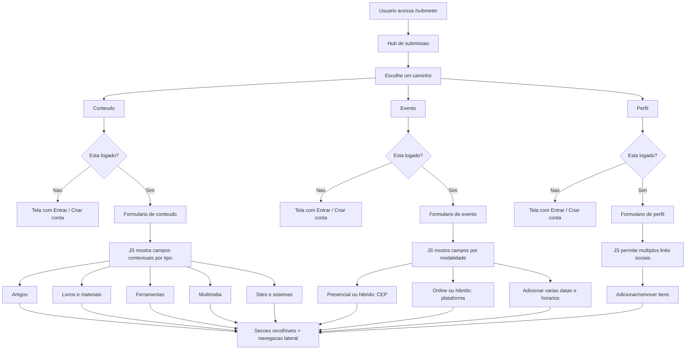
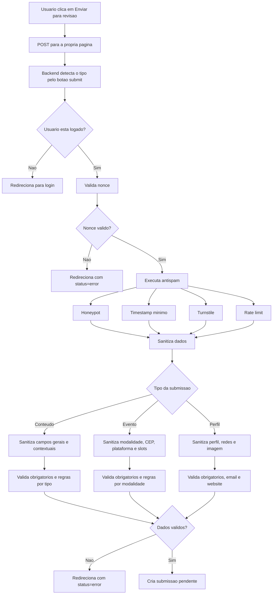
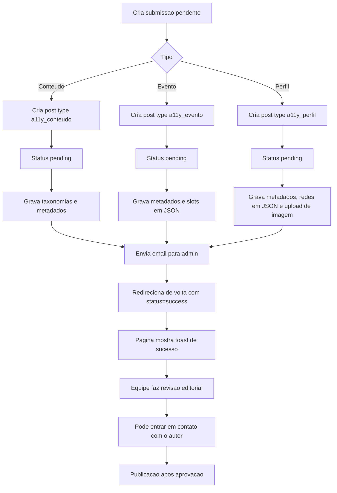

# Fluxo de Submissoes

Diagramas de referencia para entender a navegacao, a organizacao do conteudo e o fluxo de submissao no tema.

## 1. Navegacao E Organizacao Do Conteudo

## 2. Fluxo De Submissao

## 3. Persistencia, Revisao E Saida

